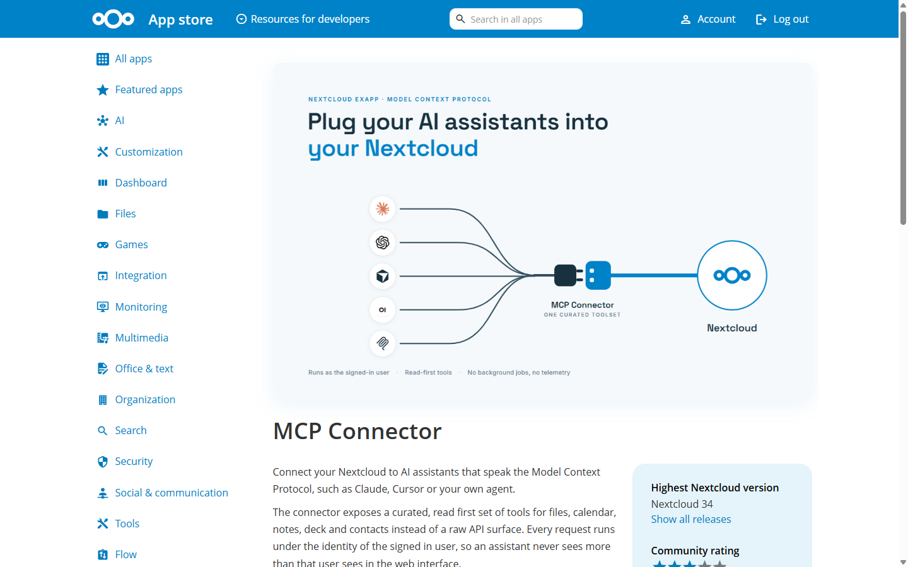
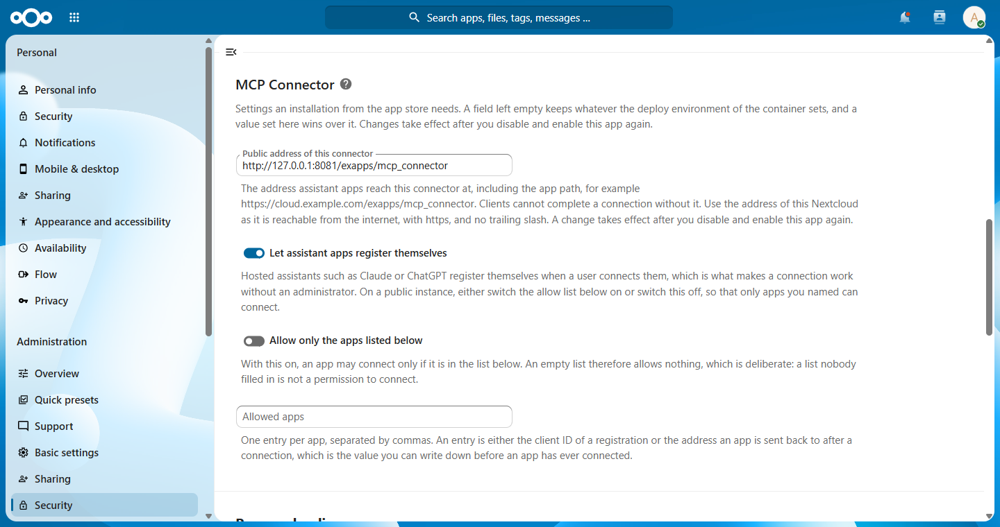
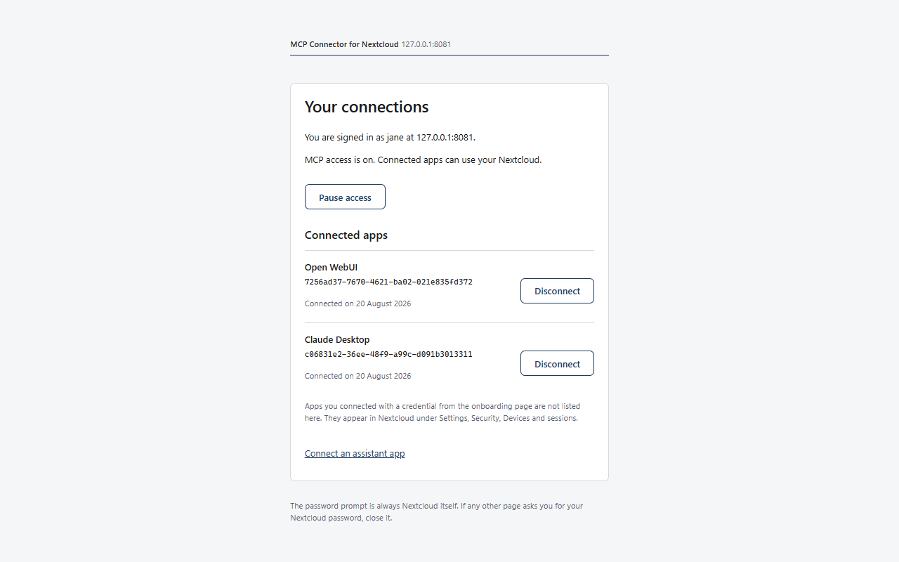

[English](README.md) | [Deutsch](README.de.md) | **Français**

> Le README anglais (README.md) fait foi ; cette traduction est mise à jour ensuite.

# MCP Connector for Nextcloud

Un serveur MCP soigneusement sélectionné qui relie votre Nextcloud (fichiers, agenda, notes, deck,
contacts, Tables et Talk) à des assistants IA tels que Claude, Cursor, ChatGPT ou vos propres agents.

**Ce serveur ne peut jamais supprimer, écraser ou repartager quoi que ce soit.**

Cette phrase est la contrainte de conception, pas une promesse de bon comportement. Le serveur
n'implémente aucun appel destructeur : pas de DELETE, pas de MOVE, pas d'écrasement, pas de
modification de partage. Les outils d'écriture sont en création seule, et une collision de nom est
traitée par un refus clair plutôt que par un écrasement silencieux.

Deux autres propriétés découlent de la même idée :

- **L'assistant ne voit jamais plus que vous.** Chaque requête s'exécute avec vos propres
  identifiants Nextcloud, si bien que les permissions Nextcloud s'appliquent sans changement.
- **Un ensemble d'outils délibérément restreint.** Les 20 outils sont sélectionnés de façon que ce
  serveur cohabite avec vos autres serveurs MCP, même dans des clients avec une limite stricte du
  nombre d'outils.

Licence : AGPL-3.0-or-later. L'app id, les noms de paquets et le nom du dépôt sont figés, voir
[docs/app-id-freeze.md](docs/app-id-freeze.md).

## Statut

Version 0.1.7. L'application est référencée dans l'App Store de Nextcloud et installable comme
ExApp Nextcloud via AppAPI. Ce qui est en place aujourd'hui, et où chacune de ces affirmations est
consignée :

- Les 20 outils de l'ensemble v1 sont implémentés, et le tableau des outils ci-dessous n'est plus
  maintenu à la main : un test de contrat lit le registre d'outils en direct et échoue si un nom
  ou un niveau de permission du tableau est en désaccord avec lui.
- La connexion OAuth 2.1 est vérifiée de bout en bout face aux deux connecteurs hébergés pour
  lesquels elle a été construite, Claude.ai et ChatGPT, avec l'enregistrement dynamique de client
  et la rotation des refresh tokens. Le parcours et les mesures figurent dans
  [docs/oauth-setup.md](docs/oauth-setup.md).
- Gestion par compte : chaque compte met en pause ou reprend son propre accès MCP et déconnecte
  individuellement chaque assistant connecté sur la page des connexions de cette application, que
  Nextcloud référence sous Paramètres, Sécurité, MCP Connector.
- `prepare_context` regroupe une recherche et la semaine à venir en un seul appel, de sorte
  qu'une question coûte un aller-retour au lieu de plusieurs.

Nouveau dans la 0.1.4 : Tables et Talk. Un assistant parcourt les tableaux du compte et ajoute
une ligne à l'un d'eux en nommant les titres de colonnes, il lit les conversations du compte et
l'historique de l'une d'elles, et il envoie un message dans une conversation. La lecture d'une
conversation ne laisse aucune trace : aucun marqueur de lecture n'est déplacé, aucune
notification n'est acquittée et le statut en ligne reste tel quel. Talk est la seule famille où
un assistant peut présenter quelque chose à d'autres personnes : un administrateur peut donc
désactiver cet envoi pour toute l'instance, et un message qui mentionne tout le monde, un groupe
entier ou une équipe entière d'un coup n'est jamais envoyé.

Installation pas à pas pour Claude Desktop, Claude Code et les clients HTTP distants, y compris les
trois erreurs qui surviennent réellement : **[docs/client-setup.md](docs/client-setup.md)**.

### OAuth 2.1

Installé comme ExApp Nextcloud, ce serveur est aussi son propre serveur d'autorisation OAuth 2.1,
conforme à la spécification d'autorisation MCP : enregistrement dynamique de client, PKCE S256,
jetons liés à une audience, rotation des refresh tokens avec détection de réutilisation et
révocation immédiate. Un client tel que Claude.ai ou ChatGPT reçoit une seule URL, connecte
l'utilisateur sur les propres pages de Nextcloud et ne voit jamais de mot de passe ni d'App
password. La connexion apparaît sous Paramètres, Sécurité, Appareils et sessions et peut y être
close.

Depuis la 0.1.3 : une application d'assistant peut
aussi s'identifier par l'adresse d'un document de métadonnées qu'elle publie elle-même, au lieu
de s'enregistrer ici d'abord. C'est la voie que la spécification MCP actuelle préfère, et celle
par laquelle Claude Code se connecte. Les deux voies fonctionnent côte à côte, et un
administrateur peut désactiver l'une ou l'autre.

Ce qu'un administrateur doit régler, ce qu'un utilisateur saisit, et les mesures qui étayent les
deux : **[docs/oauth-setup.md](docs/oauth-setup.md)**.

## Dans l'App Store de Nextcloud

L'application est référencée sous le nom **MCP Connector** :
**[apps.nextcloud.com/apps/mcp_connector](https://apps.nextcloud.com/apps/mcp_connector)**

[](https://apps.nextcloud.com/apps/mcp_connector)

Elle s'installe comme ExApp Nextcloud : activer AppAPI, enregistrer un démon de déploiement,
puis déployer et activer l'application. Sous **Nextcloud 34.0.3**, la gestion des applications
s'en charge : la liste des applications affiche l'ExApp avec son démon de déploiement, le
bouton d'installation d'une ExApp s'appelle « Deploy and enable », et « Remove » se trouve dans
le menu d'actions d'une ExApp désactivée (mesuré sur 34.0.3.2 le 2026-08-20). Sous 34.0.2 et
antérieur, la gestion n'affiche aucune ExApp, et occ reste la voie fiable sur toutes les
versions. Le parcours complet, avec les commandes occ exactes et les pièges réellement
rencontrés, se trouve dans **[docs/exapp-install.md](docs/exapp-install.md)** (en anglais).

Après l'installation, l'application enregistre ses réglages sous Paramètres, Administration,
Sécurité :



Chaque compte gère ses propres connexions sur la page des connexions de l'application, que
Nextcloud référence sous Paramètres, Sécurité, MCP Connector :



## FAQ

**Mon administrateur a installé cette application. Puis-je la désactiver pour moi ?**

Oui, et vous n'avez pas besoin de votre administrateur pour cela. Rien ne tourne en arrière-plan :
le connecteur n'agit qu'à la demande d'un assistant que vous avez connecté vous-même, il n'y a ni
tâche planifiée, ni indexation, ni télémétrie. Votre propre compte dispose d'un interrupteur sur
la page des connexions de cette application, que Nextcloud référence sous Paramètres, Sécurité,
MCP Connector, et chaque assistant connecté peut être déconnecté séparément, ce qui rend son mot
de passe d'application Nextcloud à Nextcloud.

La réponse complète, avec la frontière entre ce que cette application contrôle et ce que décide le
fournisseur de votre assistant : **[docs/faq.md](docs/faq.md)** (en anglais).

## Démarrage rapide (stdio)

Vous avez besoin d'un App password Nextcloud, pas de votre mot de passe de connexion. Créez-en un
dans Nextcloud sous Paramètres, Sécurité, Appareils et sessions.

```bash
uv tool install nextcloud-mcp-connector   # or: uv run nc-mcp inside a checkout

export NC_MCP_URL=https://cloud.example.com
export NC_MCP_USER=alice
export NC_MCP_APP_PASSWORD=xxxxx-xxxxx-xxxxx-xxxxx-xxxxx

nc-mcp
```

Configuration du client, par exemple pour Claude Desktop ou Cursor :

```json
{
  "mcpServers": {
    "nextcloud": {
      "command": "nc-mcp",
      "env": {
        "NC_MCP_URL": "https://cloud.example.com",
        "NC_MCP_USER": "alice",
        "NC_MCP_APP_PASSWORD": "xxxxx-xxxxx-xxxxx-xxxxx-xxxxx"
      }
    }
  }
}
```

## Mode HTTP

Le même serveur parle également Streamable HTTP pour les clients distants :

```bash
export NC_MCP_URL=https://cloud.example.com
export NC_MCP_ALLOWED_HOSTS=mcp.example.com
uv run uvicorn mcp_connector.entry_http:app --host 127.0.0.1 --port 8765
```

Le point de terminaison MCP est `POST /mcp`, et `GET /health` répond
`{"status":"ok","version":"..."}` sans authentification. Un seul point de terminaison sert les deux
générations du protocole : les clients sur la spécification actuelle et les clients bâtis sur le MCP
SDK 1.x sont routés selon la version de protocole de leur requête, et un redémarrage ne peut pas
interrompre une conversation car le serveur ne conserve aucun état de session.

Les identifiants ne sont pas lus depuis l'environnement dans ce mode. Ils voyagent par requête dans
l'en-tête `Authorization` (Basic, utilisateur et App password) et sont transmis sans changement à
Nextcloud, qui les authentifie. Le serveur ne traite jamais l'en-tête comme une revendication
d'identité qui lui serait propre, et il ne stocke rien, si bien qu'un seul déploiement peut servir
plusieurs utilisateurs sans stockage d'identifiants.

Pour les déploiements mono-utilisateur, un Bearer token statique est disponible à la place :
définissez `NC_MCP_STATIC_BEARER`, et le compte Nextcloud est pris depuis l'environnement comme en
mode stdio. Les deux modes HTTP sont mutuellement exclusifs.

`NC_MCP_ALLOWED_HOSTS` n'est pas optionnel en pratique. Sans lui, la couche de transport n'accepte
que `Host: localhost` et `Host: 127.0.0.1` et répond à toute autre requête par `421 Misdirected
Request` avant qu'aucun code MCP ne s'exécute. Notez qu'il s'agit de l'en-tête `Host` des requêtes
entrantes, pas de l'adresse d'écoute : `--host 0.0.0.0` n'ouvre à personne.

## Variables d'environnement

| Variable | Mode | Requis | Rôle |
|----------|------|----------|---------|
| `NC_MCP_URL` | all | oui | URL de base de votre Nextcloud, y compris un sous-chemin si vous en utilisez un |
| `NC_MCP_USER` | stdio, static bearer | oui | Identifiant utilisateur Nextcloud |
| `NC_MCP_APP_PASSWORD` | stdio, static bearer | oui | App password depuis Paramètres, Sécurité, Appareils et sessions |
| `NC_MCP_ALLOWED_HOSTS` | HTTP | oui en pratique | Liste d'autorisation d'en-têtes `Host` de ce serveur, séparés par des virgules ; un joker de port est ajouté par nom |
| `NC_MCP_STATIC_BEARER` | HTTP | non | Bearer token statique pour les déploiements mono-utilisateur ; sans lui, les clients s'authentifient par requête |
| `NC_MCP_DISABLE_DNS_REBINDING_PROTECTION` | HTTP | non | À mettre à `true` uniquement derrière un proxy qui contrôle l'en-tête `Host` |
| `NC_MCP_PUBLIC_URL` | static bearer, ExApp | oui pour OAuth | URL publique de ce serveur. En mode ExApp, c'est l'émetteur (issuer) du serveur d'autorisation et la ressource du document de ressource protégée, si bien qu'OAuth ne fonctionne pas sans elle |
| `NC_MCP_OAUTH_DCR` | ExApp | non | Enregistrement dynamique de client, activé sauf s'il est désactivé |
| `NC_MCP_OAUTH_CIMD` | ExApp | non | Un client peut s'identifier par l'adresse d'un document de métadonnées qu'il publie lui-même, activé sauf s'il est désactivé ; désactiver l'enregistrement automatique ferme cette voie avec lui |
| `NC_MCP_OAUTH_ALLOWLIST_ONLY` | ExApp | non | Seuls les clients listés peuvent s'autoriser ; une liste vide ferme alors la porte à tout le monde |
| `NC_MCP_OAUTH_ALLOWED_CLIENTS` | ExApp | non | Ids de client ou redirect URIs séparés par des virgules, lus uniquement quand l'allowlist est active |
| `NC_MCP_TALK_SEND` | all | non | Le canal Talk sortant de cette application, activé sauf s'il est mis à off. Avec off, aucun assistant ne peut envoyer de message Talk via ce connecteur, quels que soient les droits du compte dans Talk lui-même ; la lecture des conversations et de leur historique n'est pas affectée. En mode ExApp, le formulaire d'administration écrit cette valeur |

Aucun identifiant n'est jamais journalisé, dans aucun mode.

## Outils

Niveaux de permission : **read** signifie que l'outil ne fait que lire, **create-only** signifie que
l'outil peut créer de nouveaux objets mais ne peut jamais modifier ni supprimer ceux qui existent.

| Tool | Permission | Ce qu'il fait |
|------|------------|--------------|
| `files_search` | read | Recherche fichiers et dossiers par nom via WebDAV search ; le contenu n'est pas indexé |
| `files_list` | read | Liste les enfants directs d'un dossier, avec tailles et dates de modification |
| `files_read` | read | Lit le contenu d'un seul fichier |
| `files_upload` | create-only | Téléverse un nouveau fichier ; un chemin existant est refusé, jamais écrasé |
| `calendar_list_events` | read | Liste les événements dans une plage de temps explicite, avec un fuseau horaire explicite |
| `calendar_create_event` | create-only | Crée un nouvel événement ; les événements existants ne sont jamais modifiés |
| `notes_search` | read | Trouve des notes par titre et contenu via le fournisseur de recherche de notes Nextcloud |
| `notes_read` | read | Lit une seule note |
| `notes_create` | create-only | Crée une nouvelle note ; les notes existantes ne sont jamais modifiées |
| `deck_browse` | read | Parcourt les tableaux, piles et cartes de Deck |
| `deck_create_card` | create-only | Crée une nouvelle carte dans une pile ; les cartes existantes ne sont jamais modifiées |
| `tables_browse` | read | Parcourt Tables : les tables, les colonnes d'une table ou ses lignes |
| `tables_create_row` | create-only | Ajoute une ligne désignée par les titres de colonnes ; les lignes existantes ne sont jamais modifiées |
| `talk_browse` | read | Parcourt Talk : les conversations de ce compte, ou l'historique de l'une d'elles |
| `talk_send` | create-only | Envoie un message dans une conversation ; un message n'est jamais modifié ni supprimé, et une administratrice peut désactiver l'envoi pour toute l'instance |
| `contacts_search` | read | Recherche des contacts dans les carnets d'adresses |
| `unified_search` | read | Interroge la recherche unifiée de Nextcloud à travers les fournisseurs, en respectant les permissions |
| `prepare_context` | read | Regroupe fichiers, notes et cartes correspondants avec la semaine d'événements à venir pour une même question |
| `search` | read | Point d'entrée de recherche compatible OpenAI, délègue à la recherche unifiée |
| `fetch` | read | Point d'entrée de récupération compatible OpenAI, résout un id vers un fichier, une note, une carte ou un événement |

`search` et `fetch` existent parce que le profil de connecteur ChatGPT exige exactement ces deux noms
et schémas. Ce sont de fines enveloppes autour des outils ci-dessus, pas une seconde implémentation.

### Fichiers : ce que la recherche met réellement en correspondance

`files_search` utilise WebDAV search, qui met en correspondance des **noms**, pas le contenu des
fichiers. Un mot qui n'apparaît qu'à l'intérieur d'un document ne produit aucun résultat, et c'est
le comportement du protocole, pas un défaut de ce serveur. Chaque réponse de recherche porte donc la
même note :

```json
{"query":"budget","folder":"/","count":1,"items":[{"path":"/Docs/budget-2026.md","name":"budget-2026.md","kind":"file","size":2048,"content_type":"text/markdown","modified":"Thu, 14 Aug 2026 10:00:00 GMT","id":"file:4711"}],"note":"matched on names only; contents are not indexed"}
```

La recherche en texte intégral nécessiterait une application Nextcloud installée séparément, si bien
que la réponse honnête est la note ci-dessus plutôt qu'un résultat vide silencieux.

`files_list` renvoie les enfants directs d'un dossier, les dossiers d'abord puis les noms. Le dossier
lui-même ne fait jamais partie de sa propre liste, et un chemin qui pointe vers un fichier reçoit une
explication au lieu d'une liste vide.

### Listes longues : des handles de curseur plutôt que des sessions

Une liste qui a dû s'arrêter prématurément le signale et remet un handle :

```json
{"items": ["..."], "truncated": true, "next": "eyJmIjoiLyIsIm8iOjI1LCJxIjoiYnVkZ2V0In0"}
```

Renvoyez cette valeur comme paramètre `cursor` pour continuer. Le handle est du base64url de JSON
compact et contient toute la position, si bien que le serveur ne conserve aucune session : un handle
fonctionne encore après un redémarrage du serveur, et il fonctionne face à un autre processus du même
serveur. Il n'est délibérément pas signé, car il ne porte ni secret ni permission. Les identifiants
proviennent du canal d'authentification à chaque appel, si bien qu'un handle modifié ne peut que
paginer différemment à travers les propres données de l'appelant. Un handle issu d'une autre requête
est refusé plutôt que de renvoyer discrètement la mauvaise page.

### Heures de l'agenda

CalDAV est le seul endroit où une petite erreur de temps produit une réponse confidemment fausse, si
bien que les outils d'agenda sont explicites à ce sujet :

- `start` et `end` sont requis et doivent porter un fuseau, par exemple `2026-09-01T00:00:00+02:00`
  ou `2026-09-01T00:00:00Z`. Une valeur sans fuseau est refusée au lieu d'être devinée.
- Les événements récurrents sont dépliés par Nextcloud lui-même, si bien que chaque occurrence
  revient sous forme de temps absolu. Le paramètre optionnel `timezone` (un nom IANA tel que
  `Europe/Berlin`) change seulement la façon dont la réponse est écrite, jamais quels événements elle
  contient.
- Les événements sur la journée entière sont des dates sans heure et sont marqués par `all_day`. Leur
  date de fin est exclusive, telle que la définit la RFC 5545 : un événement le 24 octobre se termine
  le 25 octobre.
- `calendar_create_event` relit une fois l'événement créé et rapporte les heures que le serveur a
  stockées, pas celles qui lui ont été demandées.

### Contacts

`contacts_search` est en lecture seule, et le reste dans cette version : il n'y a aucun chemin
d'écriture CardDAV du tout.

- Le terme de recherche est mis en correspondance par Nextcloud lui-même avec le nom complet et les
  adresses mail d'une fiche, insensible à la casse et aux accents. Un numéro de téléphone est renvoyé
  mais pas recherché.
- Chaque carnet d'adresses du compte est interrogé en même temps. Celui qui échoue est nommé sous
  `degraded`, si bien qu'une réponse partielle est visiblement partielle.
- Les deux collections que Nextcloud génère pour chaque compte sont écartées : l'annuaire des comptes
  de l'instance (`z-server-generated--system`, affiché comme "Accounts") et la liste des "contacts
  récents". Aucune n'est un carnet d'adresses que l'utilisateur tient, et une recherche par nom ne
  devrait pas distribuer l'annuaire de toute une organisation comme effet de bord.
- Un compte sans carnet d'adresses propre reçoit une erreur qui nomme
  `occ dav:create-addressbook <user> contacts`, jamais un résultat vide : "aucun carnet d'adresses"
  et "aucun contact correspondant" sont des réponses différentes.

### Deck

Deck est un seul outil de navigation avec un niveau, pas un outil par niveau :

```json
{"level":"cards","count":2,"results":[{"id":"card:2:11:101","title":"Deck-Client bauen","stack":"To Do","url":"https://cloud.example.org/index.php/apps/deck/card/101"}]}
```

- `deck_browse(level="boards")` liste les tableaux avec `can_edit`, `level="stacks"` a besoin d'un
  `board_id` et rapporte combien de cartes contient une pile, `level="cards"` renvoie les cartes
  elles-mêmes. Un niveau invalide est rejeté par le schéma, et un `board_id` manquant nomme le
  paramètre au lieu d'en deviner un.
- `level="cards"` coûte exactement **une** requête HTTP par tableau, car Nextcloud envoie déjà les
  cartes à l'intérieur de la réponse des piles. Un test compte les requêtes, face au mock et face à
  une instance réelle.
- Un id de carte est la forme longue canonique `card:<board>:<stack>:<card>`, qui adresse la carte à
  travers l'API publique de Deck sans recherche préalable.
- `deck_create_card` ne fait que créer. Il n'y a aucune mise à jour, aucune suppression et aucune
  création de tableau ou de pile nulle part dans le chemin de code de Deck. Un titre de plus de 255
  caractères ou une date d'échéance qui n'est pas ISO-8601 est refusé avant la requête, et un compte
  dont le Nextcloud interdit la création de tableau est vérifié au regard des propres permissions du
  tableau, si bien qu'un tableau en lecture seule est expliqué au lieu de recevoir une réponse 403.

### Recherche à l'échelle du cloud

`unified_search` interroge chaque fournisseur de recherche que l'instance offre, en même temps :

```json
{"query":"budget","count":2,"results":[{"id":"file:4711","title":"Budget 2026.md","subline":"in Dokumente","url":"https://cloud.example.org/index.php/f/4711","provider":"files","kind":"file"},{"id":"url:https://cloud.example.org/index.php/call/abc123","title":"Khaled","url":"https://cloud.example.org/index.php/call/abc123","provider":"spreed","kind":"url","resolvable":false}],"note":"matched on names and metadata; file contents are not indexed","degraded":[{"provider":"search-deck-card-board","reason":"The provider did not answer within 15 seconds."}]}
```

- La liste des fournisseurs provient de Nextcloud à chaque appel et n'est jamais codée en dur, car
  elle suit les applications installées. Une application activée il y a une minute est interrogeable
  sans redémarrage.
- Chaque fournisseur reçoit son propre délai d'expiration. Celui qui échoue ou se bloque est nommé
  sous `degraded` avec un motif, si bien qu'une réponse partielle est toujours visiblement partielle,
  jamais une liste discrètement plus courte.
- Les permissions sont l'affaire de Nextcloud : chaque fournisseur s'exécute en tant qu'utilisateur
  authentifié, et ce serveur ne tient aucun index et ne met aucun résultat en cache.
- Les résultats de Files, Notes et Deck portent un id que les outils de lecture comprennent. Tout le
  reste reçoit un id `url:` et `resolvable: false`, car un id inventé résoudrait vers le mauvais
  objet. Le fournisseur de Deck ne rapporte qu'un id de carte, si bien que sa forme courte
  `card:<cardId>` est marquée de la même façon.
- `providers` restreint la diffusion à un sous-ensemble séparé par des virgules, par exemple
  `files,notes`. Un nom que l'instance ne connaît pas est rapporté sous `degraded` au lieu d'être
  silencieusement ignoré.
- `limit` s'applique par fournisseur et est de nouveau plafonné par Nextcloud lui-même. Si un
  fournisseur pagine, son curseur revient sous `cursors`.

### Profil de connecteur ChatGPT

`search` et `fetch` sont les deux noms que le connecteur OpenAI recherche. Leurs paramètres sont
`query` et `id`, leurs noms de champs sont fixes, et ce sont les deux seuls outils de ce serveur à
livrer un output schema, car ChatGPT lit la charge utile comme contenu structuré :

```json
{"results":[{"id":"file:4711","title":"Budget 2026.md","url":"https://cloud.example.org/index.php/f/4711","text":"in Dokumente"}]}
```

```json
{"id":"file:4711","title":"Budget 2026.md","text":"# Budget 2026 ...","url":"https://cloud.example.org/index.php/f/4711","metadata":{"kind":"file","path":"/Dokumente/Budget 2026.md","content_type":"text/markdown"}}
```

- `search` n'ajoute aucune seconde recherche. Il appelle `unified_search` et renomme les champs, si
  bien que les deux outils répondent à la même question de la même façon.
- Chaque résultat porte une URL absolue et non vide sur l'instance configurée. ChatGPT ne crée des
  métadonnées de citation que tant que `url` est une chaîne non vide, si bien qu'une URL vide ferait
  discrètement disparaître la source.
- `fetch` résout les quatre types d'id que les outils de lecture comprennent : `file:<fileid>`
  (recherché par une seule WebDAV search sur `oc:fileid`), `note:<id>`,
  `card:<board>:<stack>:<card>` y compris la forme courte `card:<cardId>` du fournisseur de recherche
  Deck, et `event:<calendar>:<object>`.
- Un id `url:` reçoit une réponse honnête : ce serveur ne requête jamais une URL issue d'un résultat
  de recherche, et il le dit au lieu d'inventer du contenu. Un préfixe inconnu est refusé avec la
  liste de ceux qui sont valides, car résoudre un message de chat comme une note est pire qu'une
  erreur.
- Un fichier long est coupé à la même limite que `files_read`. La coupe est marquée à l'intérieur de
  `text` et de nouveau dans `metadata`, avec le décalage à partir duquel continuer.

### Applications optionnelles

Notes, Deck, Tables et Talk sont des applications Nextcloud optionnelles, neuf outils en tout. La liste
des outils est la même partout : elle ne dépend jamais des applications qu'une instance possède, si bien
qu'elle reste mise en cache et prévisible pour chaque client. Si une application manque, l'outil le dit
en une phrase et nomme une alternative, par exemple "The Notes app is not installed on this Nextcloud.",
"The Tables app is not enabled on this Nextcloud." ou "The Talk app is not available on this Nextcloud."
Les agendas et les contacts n'ont besoin d'aucune application : CalDAV et CardDAV font partie du cœur de
Nextcloud.

## Ce que ce serveur ne peut pas faire

- **Aucune suppression.** Aucun outil n'émet de DELETE contre des fichiers, événements, notes, cartes
  ou contacts.
- **Aucun écrasement.** Les écritures sont en création seule. `files_upload` refuse un chemin cible
  existant avec une erreur claire au lieu de le remplacer, et les outils de création ne touchent
  jamais un objet existant.
- **Aucun déplacement ni renommage.** MOVE et COPY ne sont pas implémentés.
- **Aucune modification de partage.** Le serveur ne crée, ne modifie ni ne supprime de partages, et
  il ne change jamais les permissions.
- **Aucun accès administrateur.** Le serveur agit comme un utilisateur avec un App password et hérite
  exactement des permissions de cet utilisateur.
- **Aucune recherche en texte intégral dans le contenu des fichiers** à moins que l'application
  Nextcloud Full text search ne soit installée et configurée. Sans elle, la recherche de fichiers met
  en correspondance les noms et les métadonnées.
- **Aucune tâche d'arrière-plan, aucune synchronisation, aucune copie locale de vos données.** Chaque
  appel va vers votre Nextcloud et revient.

## Limitations connues

Des choses qui ne sont pas des défauts mais qui vous surprendront une fois. Chacune est un compromis
délibéré, et chacune est visible dans la réponse que donne l'outil plutôt que cachée derrière un
résultat vide.

| Limitation | Ce que vous voyez | Que faire |
|------------|--------------|------------|
| **La recherche met en correspondance les noms, pas le contenu** | Chaque réponse de recherche porte `"note":"matched on names only; contents are not indexed"` | Installer et configurer l'application Nextcloud Full text search, ou rechercher par nom de fichier |
| **Un compte créé avec `occ user:add` n'a pas d'agenda** | `calendar_list_events` renvoie une erreur qui nomme l'agenda manquant | `occ dav:create-calendar <user> personal`, ou se connecter une fois à Nextcloud par l'interface web, ce qui le crée |
| **Il en va de même pour le carnet d'adresses** | `contacts_search` nomme la solution au lieu de ne rien renvoyer | `occ dav:create-addressbook <user> contacts` |
| **Notes, Deck, Tables et Talk sont des applications optionnelles** | Les outils restent dans `tools/list` partout et répondent "The Notes app is not installed on this Nextcloud.", "The Tables app is not enabled on this Nextcloud." ou "The Talk app is not available on this Nextcloud." | Installer l'application, ou ignorer ces neuf outils |
| **Rien ne peut être supprimé ni écrasé** | `files_upload` refuse un chemin existant avec un conflit, et il n'y a aucun outil de mise à jour ou de suppression du tout | Choisir un autre nom. C'est la contrainte de conception, pas une fonctionnalité manquante |
| **Aucune session, donc aucun état de pagination côté serveur** | Une liste longue remet un handle `next` que vous passez de nouveau | Rien. Le handle survit à un redémarrage, ce qui est le but |
| **Les agendas ont besoin d'une fenêtre de temps explicite avec un fuseau** | Un `start` ou `end` sans fuseau est refusé | Envoyer `2026-09-01T00:00:00+02:00` ou `...Z`. Un fuseau deviné est une réponse confidemment fausse |
| **Une seule IP pour de nombreux utilisateurs déclenche la protection anti-force brute** | `429` après un mauvais App password, pour tout le monde derrière le même déploiement | Attendre et utiliser un App password correct ; voir la section dépannage dans l'installation du client |
| **Toutes les applications d'assistant ne peuvent pas terminer une connexion OAuth** | Une application qui demande à être renvoyée vers une adresse de son propre schéma, Cursor par exemple, est refusée à la connexion, et la page nomme la voie qui fonctionne | Utiliser un App password sur le même point de terminaison `/exapps/mcp_connector/mcp` ; le mode ExApp accepte les deux, voir [docs/client-setup.md](docs/client-setup.md) |

La phase 2 a rendu le serveur installable comme ExApp Nextcloud via AppAPI, chaque requête
s'exécutant sous la propre identité de l'utilisateur appelant. Trois documents en rendent compte,
ainsi que des deux spikes dont elle dépendait :

- [docs/exapp-install.md](docs/exapp-install.md) : installation de l'application comme ExApp sur la
  topologie HaRP, les preuves, les pièges connus, et le passage de relais vers la phase 5 avec
  Nextcloud AIO.
- [docs/spike-discovery.md](docs/spike-discovery.md) : la décision de découverte pour la topologie
  OAuth de la phase 3, avec la matrice mesurée et le repli sur le reverse proxy.
- [docs/spike-dav.md](docs/spike-dav.md) : le résultat de l'impersonation DAV, à savoir que les six
  familles d'API s'exécutent sous un seul mode d'impersonation, si bien qu'il n'y a pas de séparation
  de fournisseur par famille.

## Développement

```bash
uv sync
uv run pytest
uv run ruff check .
uv run ruff format --check .
```

`uv run pytest` ne démarre rien et n'a besoin de rien. Les deux couches plus lourdes sont
optionnelles (opt-in) :

- `uv run pytest -m matrix` démarre le serveur HTTP comme sous-processus et vérifie qu'un client
  actuel et un client sur MCP SDK 1.29 sont tous deux servis depuis le même point de terminaison, et
  que la conversation survit à un redémarrage. Il n'a besoin d'aucun Nextcloud.
- `uv run pytest -m integration` a besoin du Nextcloud de test local de `compose.test.yml`.

## Licence

AGPL-3.0-or-later, voir [LICENSE](LICENSE).
